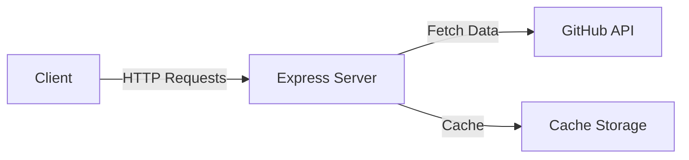

# Insight Portfolio Reader

Portfolio Insights is a single-page web app that turns any GitHub profile or repo link into an at-a-glance dashboard. It shows stars, forks & activity, a language breakdown, commit trend (90 days), and issues. A tiny Express proxy caches GitHub API results so it’s fast and your token stays server-side.

## What does it DO?
- Accepts a GitHub profile or repo URL in one box.
- For profiles: fetches repos, aggregates languages, totals stars/forks, samples issues/PRs.
- For repos: shows languages, last-90-day commits, and issues vs PRs.
- Visualizes everything with Chart.js (doughnut, line, bar).
- Caching reduces API calls; PAT stays on the backend (privacy & rate-limit friendly).

## Features
- **GitHub API Integration**: Fetch data from GitHub using a secure token-based authentication.
- **Caching Mechanism**: Implemented a simple caching system to reduce API calls and improve response times.
- **CORS Support**: Cross-Origin Resource Sharing enabled for seamless integration with frontend applications.
- **Environment Configuration**: Utilizes environment variables for sensitive data management.

## Architecture

## Tech Stack
- **Node.js**: JavaScript runtime for server-side development.
- **Express**: Web framework for building APIs.
- **Node-fetch**: Lightweight module for making HTTP requests.
- **dotenv**: Module for loading environment variables from a `.env` file.
- **CORS**: Middleware for enabling CORS in Express applications.
- **React + Vite** for frontend UI.
- **TailwindCSS**for css.

## API Endpoints
The backend provides various endpoints to interact with the GitHub API. Here are some examples:

- **GET /users/:username**: Fetch user data from GitHub.
- **GET /repos/:owner/:repo**: Retrieve repository details.
- **GET /orgs/:org/members**: List members of a GitHub organization.

*Note: Specific endpoints and their implementations may vary. Please refer to the code for detailed endpoint definitions.*

## Roadmap
- [ ] Implement additional caching strategies.
- [ ] Expand API endpoints for more GitHub data.
- [ ] Add user authentication and authorization features.
- [ ] Improve error handling and logging.
- [ ] Created and connected frontend UI.

## License
This project is licensed under the UNLICENSED license. Please see the [LICENSE](LICENSE) file for more details.
